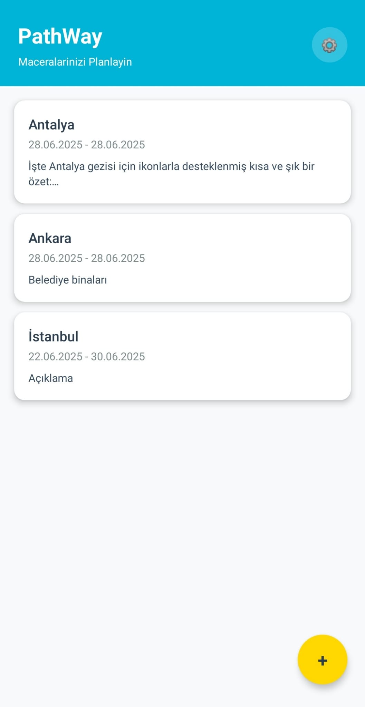
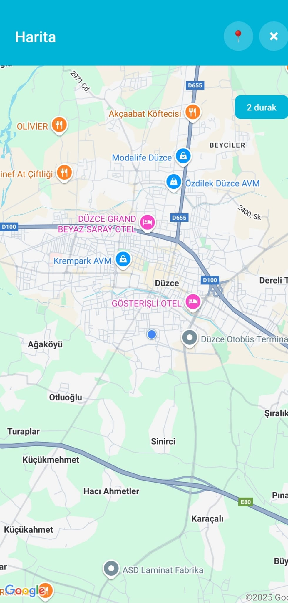
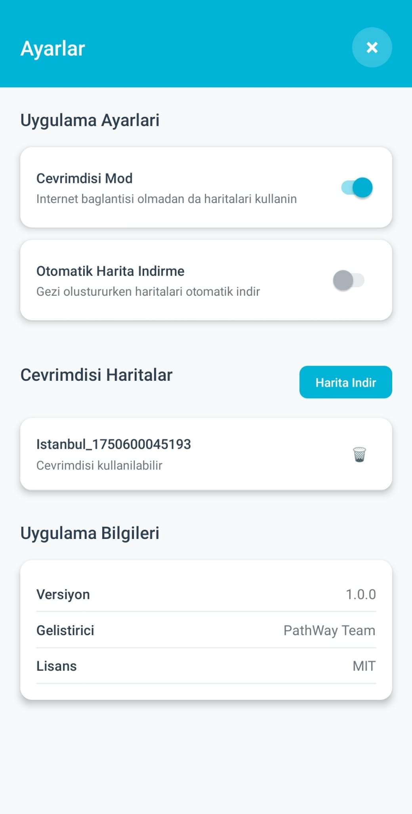
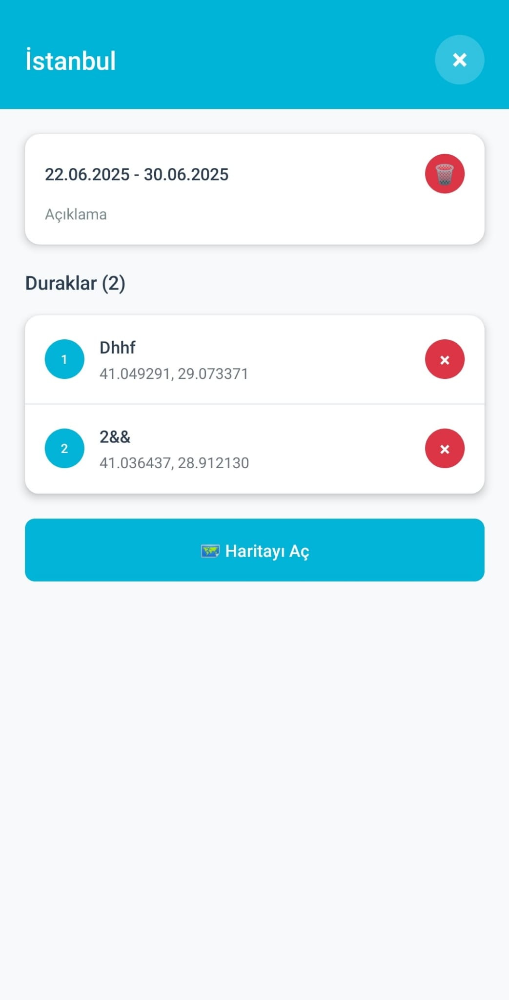
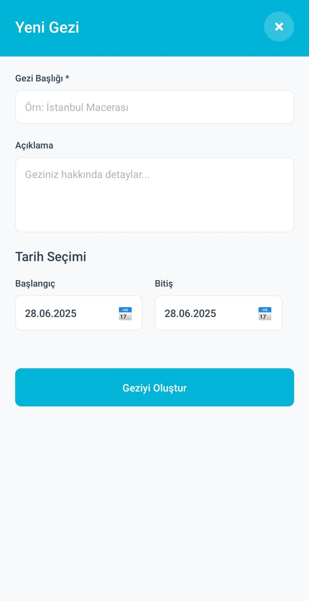

# 🗺️ PathWay - Offline Travel Planning App

<div align="center">
  
  
  
  
</div>

<br>

<div align="center">
  
</div>

## 📱 Uygulama Hakkında

PathWay, backpacker'lar ve seyahat tutkunları için geliştirilmiş **offline çalışabilen** seyahat planlama uygulamasıdır. İnternet bağlantısı olmadan da haritaları kullanabilir, gezilerinizi planlayabilir ve rotalarınızı yönetebilirsiniz.

### ✨ Özellikler

- 🗺️ **Offline Harita Desteği** - İnternet olmadan da haritaları kullanın
- 📍 **Konum Yönetimi** - Gezinize duraklar ekleyin ve yönetin
- 📅 **Tarih Planlaması** - Başlangıç ve bitiş tarihlerini belirleyin
- 💾 **Yerel Veri Saklama** - SQLite ile güvenli veri depolama
- 🎨 **Modern UI/UX** - Kullanıcı dostu ve şık arayüz
- 📱 **Cross-Platform** - iOS ve Android desteği

## 🚀 Kurulum

### Gereksinimler

- Node.js (v16 veya üzeri)
- npm veya yarn
- Expo CLI
- iOS Simulator (iOS için) veya Android Studio (Android için)

### Adımlar

1. **Projeyi klonlayın:**
```bash
git clone https://github.com/yourusername/path-way.git
cd path-way/path-way-app
```

2. **Bağımlılıkları yükleyin:**
```bash
npm install
```

3. **Uygulamayı başlatın:**
```bash
npx expo start
```

4. **Test edin:**
- **iOS**: Expo Go uygulamasını indirin ve QR kodu tarayın
- **Android**: Expo Go uygulamasını indirin ve QR kodu tarayın
- **Simulator**: Terminal'de `i` (iOS) veya `a` (Android) tuşuna basın

## 📁 Proje Yapısı

```
path-way-app/
├── src/
│   ├── navigation/
│   │   └── AppNavigator.tsx          # Ana navigasyon yapısı
│   ├── screens/
│   │   ├── HomeScreen.tsx            # Ana sayfa - Gezi listesi
│   │   ├── CreateTripScreen.tsx      # Yeni gezi oluşturma
│   │   ├── TripDetailScreen.tsx      # Gezi detayları
│   │   ├── MapScreen.tsx             # Harita ve konum yönetimi
│   │   └── SettingsScreen.tsx        # Uygulama ayarları
│   ├── services/
│   │   ├── DatabaseService.ts        # SQLite veritabanı işlemleri
│   │   ├── LocationService.ts        # Konum servisleri
│   │   ├── OfflineMapService.ts      # Offline harita yönetimi
│   │   └── SettingsService.ts        # Ayar yönetimi
│   ├── types/
│   │   └── index.ts                  # TypeScript tip tanımları
│   └── utils/
│       └── theme.ts                  # Tema ve stil tanımları
├── assets/                           # Uygulama ikonları ve görselleri
├── App.tsx                           # Ana uygulama bileşeni
└── package.json                      # Proje bağımlılıkları
```

## 🎨 Ekran Görüntüleri

<div align="center">
  <table>
    <tr>
      <td align="center">
        <strong>Ana Sayfa</strong><br>
        
      </td>
      <td align="center">
        <strong>Gezi Oluşturma</strong><br>
        
      </td>
      <td align="center">
        <strong>Harita</strong><br>
        
      </td>
      <td align="center">
        <strong>Ayarlar</strong><br>
        
      </td>
    </tr>
  </table>
</div>

## 🔧 Teknik Detaylar

### Kullanılan Teknolojiler

- **React Native 0.79.4** - Cross-platform mobil geliştirme
- **Expo 53.0.12** - Geliştirme platformu ve araçları
- **TypeScript 5.8.3** - Tip güvenliği
- **React Navigation 7.x** - Sayfa navigasyonu
- **Expo SQLite** - Yerel veritabanı
- **React Native Maps** - Harita entegrasyonu
- **Expo Location** - Konum servisleri
- **Expo File System** - Dosya sistemi işlemleri

### Veritabanı Şeması

```sql
-- Geziler tablosu
CREATE TABLE trips (
  id TEXT PRIMARY KEY,
  title TEXT NOT NULL,
  description TEXT,
  startDate TEXT NOT NULL,
  endDate TEXT NOT NULL,
  createdAt TEXT NOT NULL
);

-- Konumlar tablosu
CREATE TABLE locations (
  id TEXT PRIMARY KEY,
  tripId TEXT NOT NULL,
  name TEXT NOT NULL,
  description TEXT,
  latitude REAL NOT NULL,
  longitude REAL NOT NULL,
  address TEXT,
  createdAt TEXT NOT NULL,
  FOREIGN KEY (tripId) REFERENCES trips (id) ON DELETE CASCADE
);
```

## 🎯 Özellik Detayları

### 🏠 Ana Sayfa (HomeScreen)
- Gezi listesini görüntüleme
- Yeni gezi oluşturma (FAB butonu)
- Ayarlar sayfasına erişim
- Pull-to-refresh özelliği

### ➕ Gezi Oluşturma (CreateTripScreen)
- Gezi başlığı ve açıklaması
- Başlangıç ve bitiş tarihi seçimi
- Form validasyonu
- Native date picker kullanımı

### 📍 Harita (MapScreen)
- İnteraktif harita görünümü
- Konum ekleme (haritaya tıklama)
- Mevcut konum alma
- Konum silme
- Offline harita desteği

### ⚙️ Ayarlar (SettingsScreen)
- Çevrimdışı mod toggle
- Otomatik harita indirme
- Offline harita yönetimi
- Uygulama bilgileri

### Expo Build

```bash
# Production build
expo build:android
expo build:ios

# EAS Build (önerilen)
eas build --platform android
eas build --platform ios
```

### App Store Dağıtımı

1. **EAS Submit** kullanın:
```bash
eas submit --platform ios
eas submit --platform android
```

## 📄 Lisans

Bu proje MIT lisansı altında lisanslanmıştır. Detaylar için [LICENSE](LICENSE) dosyasına bakın.

<div align="center">
  <p>Made with ❤️ for travelers around the world</p>
  <p>⭐ Bu projeyi beğendiyseniz yıldız vermeyi unutmayın!</p>
</div> 
